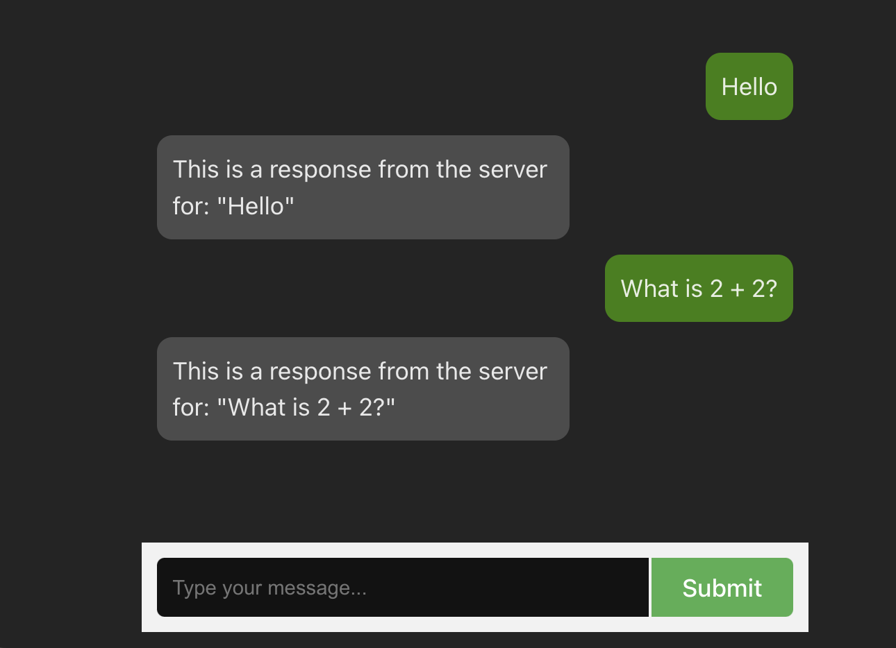

# LightCI LLM



## Setup Instructions

### Web

```terminal
cd web
npm install
npm run dev
```

### API (Django)

```terminal
cd api
pip install -r requirements.txt
python manage.py migrate
python manage.py runserver
```

## Task Instructions

Your assignment is to integrate an LLM into this existing chat app. The feature should answer the user's question as if it were Abe Lincoln, and also filter the user question for only PG rated topics, otherwise a polite message response indicating "no answer" should be provided.

> TIP: You work will mostly take place in `light_ci_messages.views`

### OpenAI API Key

Add the API key in `api/api/settings.py`

```python
OPENAI_API_KEY = '### ENTER API KEY HERE ###'
```

## Open AI Playground

You can test and debug your prompts here in the Open AI Playground

Here is a link: [https://platform.openai.com/playground/chat](https://platform.openai.com/playground/chat)
